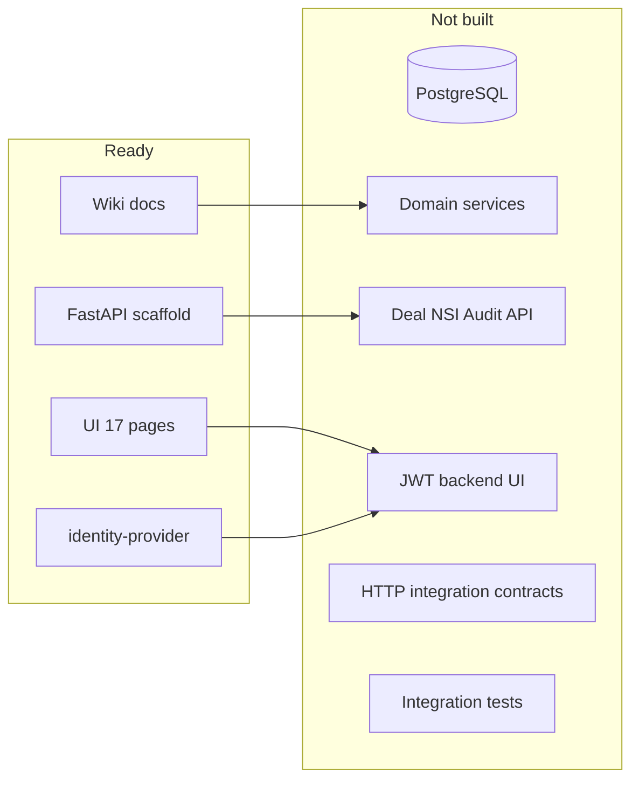
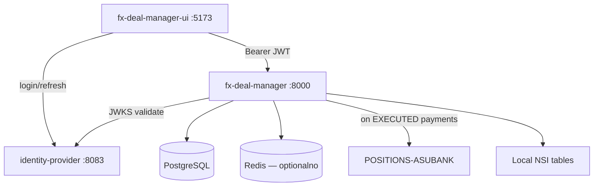

# План выполнения проекта FX-АСУБАНК

**Статус:** архивный план; фактический compose-стенд уже переведён на реальные HTTP-контракты  
**Дата:** 24.05.2026  
**Срок проекта (ТЗ):** 24.02.2026 — 25.05.2026; защита/демо — до **28.05.2026**

---

## 1. Контекст и цель

**FX-АСУБАНК** — мидл-офис система для ведения FX-сделок (TOD, TOM, Spot): создание → валидация → расчёт платежей → согласование позиционером → передача в систему позиций → отчётность.

Три репозитория образуют целевой стек:

| Репозиторий | Роль | Зрелость |
|-------------|------|----------|
| [fx-deal-manager](.) | REST API, бизнес-логика, БД | Реализован: сделки, аудит, отчёты, FX→POSITIONS, UI-контракты |
| [identity-provider](../identity-provider) | Auth, JWT, RBAC | **~70%** — login/register/refresh, JWKS, client_credentials |
| [fx-deal-manager-ui](../fx-deal-manager-ui) | Web UI | Реализован: login IdP, API-driven экраны, без запасных статических данных |

Документация ([wiki](../fx-deal-manager.wiki), ТЗ PDF, ПЗ к ТП) **полная**; реализация бизнес-логики **отсутствует**.

**Цель плана:** довести систему до **демонстрационного прототипа**, покрывающего MUST-требования (FR-001 — FR-018) с end-to-end сценарием через UI → API → БД → auth.

### Ограничение: identity-provider не изменяем

Репозиторий **identity-provider — read-only**. Любые доработки auth делаются только в **fx-deal-manager** (JWT middleware) и **fx-deal-manager-ui** (login client). IdP запускается отдельно (`docker compose up` в своём репозитории) и используется как есть:

- `POST /api/v1/auth/login`, `/refresh`, `/register`
- `GET /.well-known/jwks.json`
- Bootstrap admin и пользователи — через существующие env/API IdP (ручная регистрация curl/Swagger)
- CORS IdP уже разрешает `localhost:3000` и `localhost:5173` — UI запускать на одном из этих портов (или проксировать через nginx в fx-deal-manager)

---

## 2. Текущее состояние (gap analysis)



### Критический разрыв по FR

| Область | FR | Статус |
|---------|-----|--------|
| RBAC / auth | FR-001 | IdP готов; бэкенд и UI не подключены |
| CRUD сделок | FR-002, FR-016 | Не начато |
| Валидация / НСИ | FR-004, FR-005, FR-006 | Не начато |
| Расчёты | FR-007, FR-008, FR-009 | Не начато |
| Workflow | FR-011 — FR-014 | Не начато |
| Персистентность | FR-010 | Нет БД |
| Позиции | FR-017 | Не начато |
| Аудит | FR-018 | Не начато |
| Отчёты | FR-019 — FR-022 | SHOULD/COULD — после MVP |

---

## 3. Целевая архитектура



**Принципы реализации прототипа:**

- Монолитный FastAPI-модуль с чётким разделением слоёв (routes → services → repositories), как в [wiki Architecture](../fx-deal-manager.wiki/Architecture.md)
- PostgreSQL + Alembic; схема по [Database-Schema](../fx-deal-manager.wiki/Database-Schema.md)
- NSI — локальные справочники, система позиций — HTTP-контракт с POSITIONS-АСУБАНК
- UI: минимальная доработка статического фронта (fetch + JWT), без миграции на SPA на этапе прототипа

---

## 4. Этапы выполнения

### Этап 0. Инфраструктура и сквозной стек (2–3 дня)

**Цель:** fx-deal-manager + PostgreSQL + UI работают с уже запущенным identity-provider; пользователь логинится и видит защищённый health.

**Порядок запуска (3 терминала, IdP не трогаем):**

```bash
# 1. identity-provider (отдельно, без изменений)
cd identity-provider && docker compose up -d   # :8083

# 2. fx-deal-manager
cd fx-deal-manager && docker compose up -d     # :8000 + PostgreSQL

# 3. UI на порту из CORS-allowlist IdP
cd fx-deal-manager-ui && python3 -m http.server 5173
```

**fx-deal-manager:**

- Расширить [docker-compose.yml](docker-compose.yml): PostgreSQL, опционально Redis
- Добавить зависимости: SQLAlchemy 2.x, Alembic, asyncpg, PyJWT + httpx (JWKS)
- Env: `JWT_ISSUER=http://localhost:8083`, `JWKS_URL=http://localhost:8083/.well-known/jwks.json`
- Опционально: `docker-compose.dev.yml` с nginx для UI (статика + proxy `/api` → :8000) — всё в fx-deal-manager, без правок IdP

**fx-deal-manager-ui:**

- Заменить локальный вход в [index.html](../fx-deal-manager-ui/index.html): `POST http://localhost:8083/api/v1/auth/login` → `accessToken`/`refreshToken` в `sessionStorage`
- Добавить `js/api.js`: `IDP_URL`, `API_URL`, intercept 401 → refresh → retry
- Конфиг URL через `js/config.js` (не хардкод в IdP)

**Подготовка тестовых пользователей (без изменений IdP):**

- Использовать bootstrap admin из `.env` IdP
- Зарегистрировать TRADER/POSITIONER/AUDITOR через `POST /api/v1/auth/register` + назначить роли admin через `PATCH /api/v1/users/{id}/role` (существующий API)
- Зафиксировать учётные данные в README fx-deal-manager для демо

**Критерий готовности:** curl с JWT (полученным от IdP) проходит middleware fx-deal-manager; UI показывает имя пользователя из токена.

---

### Этап 1. Домен, БД, базовый Deal API (4–5 дней)

**Цель:** FR-002, FR-010, FR-016 (частично).

**Модели** (по [Domain-Model](../fx-deal-manager.wiki/Domain-Model.md)):

- Enums: `DealState`, `DealType`, `OperationDirection`, `PaymentDirection`, `ApprovalDecision`
- Entities: `FXDeal`, `Payment`, `PositionerSolution`, `AuditLogEntry`
- NSI (in-memory/DB): `Counterparty`, `Currency`, `NostroAccount`, `BusinessCalendar`

**Миграции Alembic:** таблицы `fx_deal`, `payment`, `audit_log_entry` + lookup-таблицы.

**API endpoints:**

| Method | Path | Роль | FR |
|--------|------|------|-----|
| POST | `/api/v1/deals` | TRADER | FR-002 |
| GET | `/api/v1/deals` | ALL | FR-016 |
| GET | `/api/v1/deals/{id}` | ALL | FR-016 |
| PATCH | `/api/v1/deals/{id}` | TRADER (DRAFT) | FR-002 |

**Auth middleware:** проверка JWT через JWKS ([identity-provider/docs/python-token-validation.md](../identity-provider/docs/python-token-validation.md)); dependency `require_role(...)`.

**Критерий готовности:** трейдер создаёт сделку через API; запись в PostgreSQL; реестр возвращает фильтрованный список.

---

### Этап 2. Валидация и расчёты (3–4 дня)

**Цель:** FR-004, FR-005, FR-006, FR-007, FR-008, FR-009.

**Сервисы:**

- `ValidationService` — FLC: обязательные поля, формат сумм/курса, валютная пара, активный контрагент в НСИ
- `SettlementService` — value date по типу (TOD=сегодня, TOM=T+1, Spot=T+2) с учётом `BusinessCalendar`
- `PaymentCalculator` — 2 платежа IN/OUT по направлению BUY/SELL
- `NostroAssignmentService` — подбор nostro по валюте; ошибка если счёт не найден

**API:**

- `POST /api/v1/deals/{id}/validate` — запуск FLC + расчётов
- `GET /api/v1/nsi/counterparties`, `/currencies`, `/nostro-accounts` — read-only справочники (seed data)

**Seed NSI:** 5–10 контрагентов, валюты RUB/USD/EUR/CNY, nostro-счета, календарь на 2026.

**Критерий готовности:** после validate сделка содержит value_date и 2 payment; при ошибке — 422 с деталями; время ответа ≤ 1 сек.

---

### Этап 3. Workflow согласования (3–4 дня)

**Цель:** FR-011, FR-012, FR-013, FR-014 + FR-001 (separation of duties).

**State machine** (по [Deal-Lifecycle](../fx-deal-manager.wiki/Deal-Lifecycle.md)):

```
DRAFT → WAITING_FOR_POSITIONER → APPROVED
                               → REJECTED → DRAFT (take for edit)
```

**API:**

- `POST /api/v1/deals/{id}/submit` — TRADER; только после VALID; проверка creator ≠ approver
- `POST /api/v1/deals/{id}/approve` — POSITIONER
- `POST /api/v1/deals/{id}/return` — POSITIONER + comment → REJECTED
- `POST /api/v1/deals/{id}/reject` — POSITIONER
- `POST /api/v1/deals/{id}/take-for-edit` — TRADER (REJECTED → DRAFT)
- `GET /api/v1/deals/queue` — POSITIONER; status=WAITING

**Правила:**

- Редактирование только в DRAFT
- Self-approval запрещён (FR-001)
- Каждый переход → `AuditLogEntry`

**Критерий готовности:** полный цикл create → validate → submit → approve через API; позиционер видит очередь.

---

### Этап 4. Аудит и интеграционные контракты (2–3 дня)

**Цель:** FR-018, FR-017 (частично).

**Аудит:**

- `AuditLogService` — append-only записи при create/update/status change
- `GET /api/v1/audit-events?entity_id=&user_id=&from=&to=`

**Position system contract:**

- `PositionSystemAdapter.send_deal(deal)` — REST POST на `POSITIONS-ASUBANK /payments/incoming`
- При успехе: deal → статус «Исполнена» (расширение FR-017)
- Retry 3x с exponential backoff; логирование correlation_id

**NSI contract:**

- Справочники НСИ доступны через `GET /api/v1/nsi/*`; ручная синхронизация исключена из текущего backend-контракта

**Критерий готовности:** после approve платежи сделки уходят в POSITIONS-АСУБАНК; audit log содержит полную историю; analyst видит события.

---

### Этап 5. Интеграция UI с API (3–4 дня)

**Цель:** end-to-end demo через браузер.

**Приоритетные экраны** (связка с API):

| UI-страница | API |
|-------------|-----|
| `deals.html` | GET /deals |
| `deal-new.html` | POST /deals + validate |
| `deal-detail.html` | GET /deals/{id} |
| `deal-edit.html` | PATCH /deals/{id} |
| `queue.html`, `deal-review.html` | GET /queue, approve/return/reject |
| `counterparties.html` | GET /nsi/counterparties |
| `audit.html` | GET /audit-events |

**Изменения в UI:**

- Новый `js/api.js` + рефакторинг [js/app.js](../fx-deal-manager-ui/js/app.js)
- Замена встроенных HTML-плейсхолдеров на динамический рендер API-данных
- Маппинг ролей: JWT `TRADER`/`POSITIONER`/`AUDITOR`/`ADMIN` → существующие guards
- Toast при ошибках API (422 validation)

**Не в scope прототипа:** RFQ-торги маркет-мейкеров и push-уведомления; котировки, позиции и уведомления закрыты текущими API-контрактами.

**Критерий готовности:** демо-сценарий «трейдер создаёт Spot → позиционер одобряет» без curl.

---

### Этап 6. Отчёты и администрирование (2–3 дня, SHOULD)

**Цель:** FR-019 (базово), FR-001 (admin — через существующий IdP, без правок его кода).

- `GET /api/v1/reports/deals?from=&to=&status=` — JSON/CSV export
- `reports.html` — вызов API + download
- Admin UI (опционально): тонкий клиент в fx-deal-manager-ui, вызывающий **существующие** IdP endpoints (`GET/PATCH /api/v1/users`) — только потребление API, репозиторий IdP не меняем
- Альтернатива для демо: управление ролями через Swagger IdP (`http://localhost:8083/swagger-ui.html`)

**FR-015 (отмена сделки):** реализовать для DRAFT; для WAITING — зафиксировать как TBD или запретить (как в wiki).

---

### Этап 7. Тестирование, документация, демо (3–4 дня)

**Тесты fx-deal-manager:**

- Unit: ValidationService, SettlementService, state transitions
- Integration: pytest + Testcontainers PostgreSQL; сценарий full lifecycle
- Auth: JWT valid/invalid/expired/wrong-role

**Документация (ГОСТ, по [Project-Plan](../fx-deal-manager.wiki/Project-Plan.md)):**

- Программа и методика испытаний (ПМИ) — сценарии UAT по FR
- Руководство пользователя — по UI-экранам wiki
- Руководство администратора — deploy, seed, роли
- Обновить wiki Local-Development: порядок запуска трёх сервисов (IdP отдельно, без изменений), env-переменные JWT

**Демо-сценарии для защиты (28.05):**

1. **Happy path:** Spot EUR/RUB → validate → submit → approve → POSITIONS-АСУБАНК → audit
2. **Return for edit:** позиционер возвращает с комментарием → трейдер правит → повторная отправка
3. **Validation error:** неактивный контрагент / отсутствует nostro
4. **RBAC:** трейдер не может approve; позиционер не может create
5. **Audit trail:** просмотр истории изменений по сделке

---

## 5. Структура модулей бэкенда (целевая)

```
src/fx_deal_manager/
├── api/
│   ├── routes/          # deals, nsi, audit, reports, health
│   ├── dependencies.py  # auth, db session
│   └── middleware.py
├── core/                # config, logging
├── domain/
│   ├── models.py        # SQLAlchemy ORM
│   ├── enums.py
│   └── schemas.py       # Pydantic DTO
├── services/
│   ├── validation.py
│   ├── settlement.py
│   ├── approval.py
│   ├── audit.py
│   └── nsi.py
├── repositories/
│   └── deal_repository.py
├── integrations/
│   └── position_client.py
└── main.py
```

---

## 6. Распределение работ по репозиториям

| Задача | fx-deal-manager | identity-provider | fx-deal-manager-ui |
|--------|-----------------|-------------------|---------------------|
| PostgreSQL + миграции | ✓ | **не трогаем** | — |
| JWT middleware | ✓ | **не трогаем** (JWKS consume) | — |
| Deal lifecycle API | ✓ | **не трогаем** | — |
| Login/register | — | **готово as-is** | ✓ (клиент) |
| Seed users/roles | — | **не трогаем** (curl/Swagger) | — |
| API client + auth | — | **не трогаем** | ✓ |
| Dynamic data rendering | — | — | ✓ |
| Docker compose | ✓ (API + PG) | **свой compose, без правок** | ✓ (или nginx в fx-deal-manager) |
| Unit/integration tests | ✓ | **не трогаем** | — |
| GOST docs | ✓ | — | — |

---

## 7. Приоритизация (MVP для демо)

**Must have (блокирует демо):**

- Этапы 0–5 полностью
- FR-001, FR-002, FR-004–FR-014, FR-016, FR-018

**Should have (если останется время до 28.05):**

- FR-017 (статус «Исполнена»)
- FR-019 (простой отчёт CSV)
- FR-015 (отмена в DRAFT)

**Could have / Phase 2:**

- FR-021, FR-022
- Redis cache, async MQ
- Quotes service, live positions
- SPA-рефакторинг UI
- 2FA (из threat model)

---

## 8. Риски и митигации

| ID | Риск | Митигация |
|----|------|-----------|
| R-02 | Смежные системы недоступны | Stub-адаптеры с контрактом из [Integrations](../fx-deal-manager.wiki/Integrations.md) |
| R-03 | Неполная НСИ | Seed data + ValidationService блокирует submit |
| R-04 | Validate > 1 сек | In-memory NSI cache; индексы БД |
| R-05 | Пробелы в аудите | Domain events на каждый transition; тест на полноту |
| R-06 | Сроки | MVP-first; отложить SHOULD/COULD |
| NEW | UI без сборки — сложная интеграция | Минимальный `api.js`; не переписывать на React до демо |
| NEW | CORS IdP не покрывает :8765 | Запуск UI на :5173/:3000 или nginx-proxy в fx-deal-manager |
| NEW | IdP не меняем — нет custom seed | Ручная регистрация пользователей через существующий API; скрипт `scripts/seed-demo-users.sh` в fx-deal-manager (curl, не правки IdP) |

---

## 9. Оценка трудозатрат

| Этап | Чел.-дни | Календарь (при 2 разработчиках) |
|------|----------|----------------------------------|
| 0. Инфраструктура | 3 | 24–26.05 |
| 1. Domain + Deal API | 5 | 26–28.05 |
| 2. Валидация и расчёты | 4 | 28–30.05* |
| 3. Workflow | 4 | 30.05–01.06* |
| 4. Аудит + интеграционные контракты | 3 | параллельно с 3 |
| 5. UI интеграция | 4 | после API |
| 6. Отчёты/admin | 3 | optional |
| 7. Тесты + docs + demo | 4 | финал |

\*Календарь выходит за 28.05 — для защиты **26.05** нужен урезанный MVP: этапы 0–3 + частичный 5 (create/submit/approve на 3 экранах) + ручное API-демо для остального.

**Рекомендация для защиты 28.05:** параллельная работа — один разработчик на бэкенд (этапы 0–4), второй на UI auth + deals flow (этап 5); интеграции и audit — с первого дня.

---

## 10. Definition of Done (прототип принят)

- [ ] Все MUST FR (001, 002, 004–014, 016, 018) имеют трассируемые acceptance tests
- [ ] End-to-end сценарий через UI + JWT auth
- [ ] PostgreSQL персистентность; перезапуск не теряет данные
- [ ] OpenAPI `/docs` документирует все endpoints
- [ ] Audit log неизменяем и queryable
- [ ] Docker Compose fx-deal-manager поднимает API + PostgreSQL; IdP запускается отдельно без изменений
- [ ] ПМИ и demo script готовы к защите
- [ ] Wiki Local-Development обновлён

---

## 11. Чеклист этапов

- [x] **Этап 0:** Docker stack (PostgreSQL + UI), JWT middleware в FastAPI, real login в UI; IdP — внешняя зависимость
- [x] **Этап 1:** Alembic миграции, доменные модели, Deal CRUD API + RBAC
- [x] **Этап 2:** ValidationService, SettlementService, NSI seed, validate endpoint
- [x] **Этап 3:** State machine согласования (submit/approve/return/reject), queue API
- [x] **Этап 4:** AuditLogService, HTTP-контракт с POSITIONS-АСУБАНК, НСИ API
- [x] **Этап 5:** js/api.js, подключение deals/queue/audit/positions/quotes/notifications/settings экранов к API
- [x] **Этап 6 (optional):** Reports CSV (`GET /reports/deals`), отмена в DRAFT (`POST /deals/{id}/cancel`, FR-015), state `CANCELLED`
- [x] **Этап 7:** Integration tests (`test_stage6_cancel_reports.py`), `docs/ПМИ.md`, `docs/Руководство-*.md`, `scripts/demo.sh`
